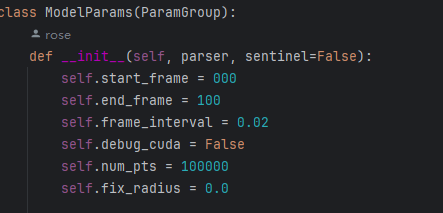

# 1.环境配置

在guassian_splatting的环境基础上需要

```
pip install opencv-python
pip install imageio
```

# 2.参数调整

在**arguments** **_init_.py**中的**ModelParams**主要需要调整

**self.start_frame**

**self.end_frame**



的值，分别对应source_path图片中的起始。默认是0到100，即为选取0-100的图像作为输入进行训练。

# 3.训练参数

```
python train.py -s "D:\projection\lidar-gaussian\kitti_mot\training\image_02\0001" -m 
"D:\projection\lidar-gaussian\kitti_mot\output\0001"

0001数据将start_frame改为380，end_frame改为431.
```

```
python train.py -s "D:\projection\lidar-gaussian\kitti_mot\training\image_02\0002" -m 
"D:\projection\lidar-gaussian\kitti_mot\output\0002"
```

```
python train.py -s "D:\projection\lidar-gaussian\kitti_mot\training\image_02\0006" -m 
"D:\projection\lidar-gaussian\kitti_mot\output\0006"
```

这部分跟gaussian_splatting的参数相同。